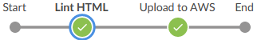

# Jenkins-Pipelines-on-AWS
#### This is the fourth project of the Udacity Cloud DevOps Nanodegree program.

# Pipeline

> In this project, I created and ran an instance on AWS, configured Jenkins, and created a pipeline to deploy a static website on S3.
